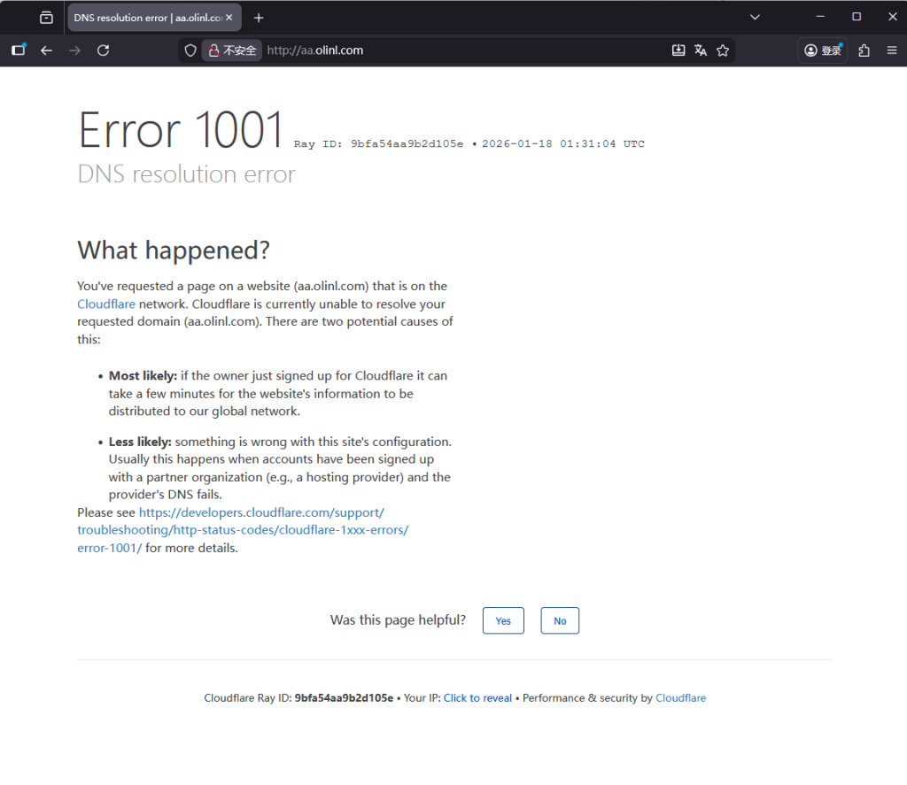
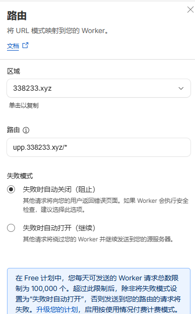
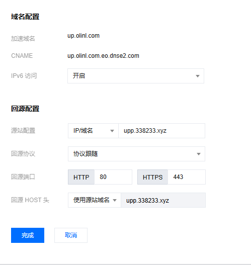
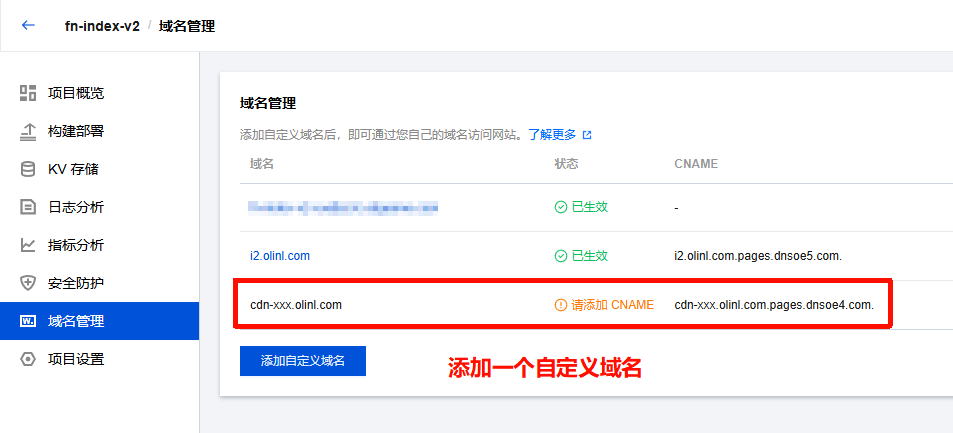
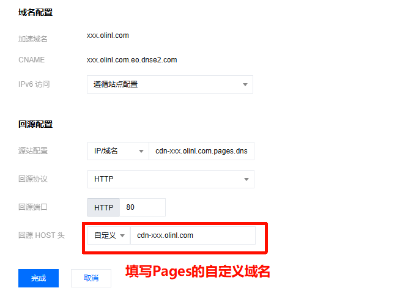
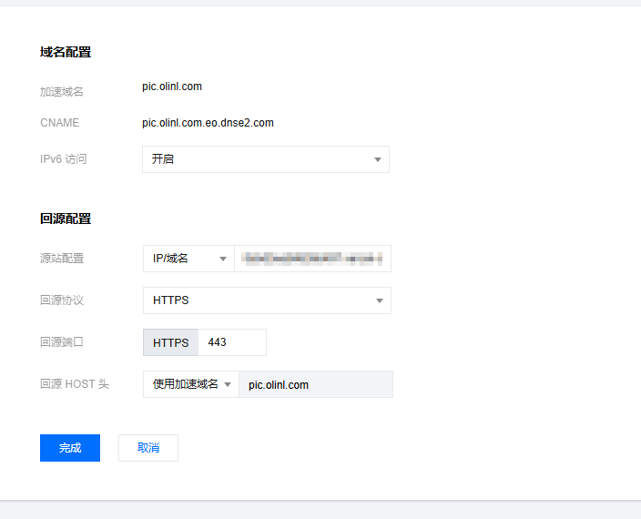
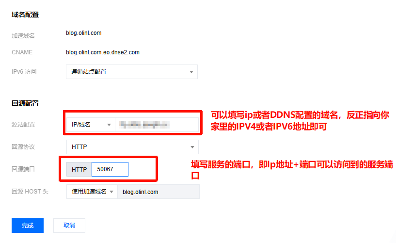

# 正式开始
对于EdgeOne可加速的站点主要有2种，大部分互联网上可访问的站点都是这2种。  
# 静态站点
这类站点是使用Vercel、Github Pages、CloudFlare Pages搭建的静态网页，通常通过Git进行订阅更新，当你推送新内容的时候，服务商会自动的拉取代码，允许CI/CD，自动打包部署上线。

想要让Pages用上EO，其实很简单，只需要把Pages的CNAME值填入到EO 域名的加速站点里面即可。下面教大家如何操作。
## CloudFlare Pages
在你的Pages 添加自定义域，记录提供的CNAME值。

进入EO，你的域名，添加域名，加速域名填写pages的自定义域，源站配置填写上面的CNAME值，协议默认80，回源HOST头选择使用加速域名。

_PS：如果出现下面的问题，那就说明CF的域名必须验证通过，是启用状态才可以。_

因为CF边缘节点的域名并没有通过DNS验证，所以会报错1001，**当然你也可以通过DNS服务商的区域做划分，让国内走EO，国外仍然使用CF。**

这个时候可以先把cf的验证通过，后面再改成EO的CNAME。  
  
## CloudFlare Workers
在你的Workers和Pages->你的项目，设置里面添加一个自定义路由。

然后把这个自定义的路由的域名解析到你的优选域名，或者添加自定义域，总之可以使用这个域名访问到Workers。

最后打开EO，你的域名，添加域名，源站配置填入cf添加的域名，回源HOST头使用源站域名。

## EdgeOne Pages
EO Pages本身就使用的是EO CDN的加速，如果你想要把你的Pages服务添加进你的加速域名里面进行统一管理，可以参考下面配置。

在Pages域名管理，添加一个自定义的域名，例如cdn-xxx.olinl.com。记录CNAME值，不需要做CNAME解析。

在你的域名，域名管理里面，添加一个加速域名，xxx.olinl.com（最终用户访问的域名），源站配置填写上面的CNAME，协议使用HTTP 80，回源HOST头自定义为cdn-xxx.olinl.com（Pages自定义域名）。

原理：当用户通过最终访问的域名访问时，会携带着回源自定义HOST头（cdn-xxx.olinl.com），到CANEM的Pages服务。

这里要注意的是：CNAME默认是HTTP，就是80访问，不支持HTTPS。

## Vercel

在你的项目-> Domains 添加一个自定义域名，和最终访问的域名一致，记录CNAME值，仍然不需要解析CNAME。

EO你的域名，添加域名，源站配置填写Vercel CNAME值，回源协议HTTPS 443，回源HOST头要和Vercel配置的域名一致，然后正常解析EO给你的CNAME值。等待配置完成即可访问。

# 动态站点
这里统称为部署在服务器上的站点需要加速。

添加域名，填写加速域名（用户最终访问的域名），源站配置填写服务器的ip，或者其他需要加速的域名，回源协议根据情况填写，如果没有ssl证书那就仅HTTP，端口也是，回源HOST头默认使用加速域名。

这里也可以直接将家用宽带的IPV6带宽带访问的服务加速成不带端口的，并加上防护和cdn。

参考如下：
