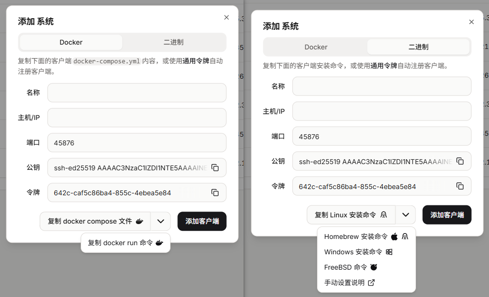
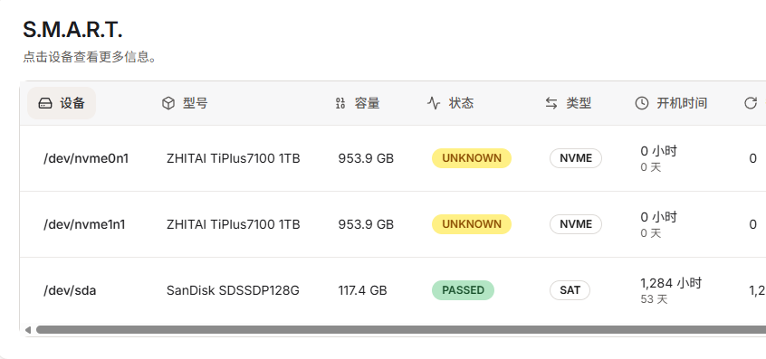
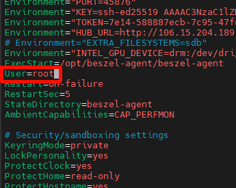

Beszel官网：[beszel.dev](https://beszel.dev/zh/)
这是一个服务监控程序，可以监控的有：服务器资源，Docker、Systemd、S.M.A.R.T.、GPU这些。

主要有2个组件：**中心 (hub)** 和 **代理 (agent)**。就是一个管理端，一个监控节点。

::note[官方文档]
下面描述的两个通信方向中的一个需要正常工作。

代理程序会向中心的 `/api/beszel/agent-connect` 发起 WebSocket 连接，因此请确保此端点可访问。如果[使用反向代理](https://blog.olinl.com/?golink=aHR0cHM6Ly9iZXN6ZWwuZGV2L3poL2d1aWRlL3JldmVyc2UtcHJveHk=&nonce=4979e26e51)，请确保它能够代理 WebSocket 连接。

中心会向代理程序发起 TCP 连接，因此请确保代理系统上的端口未被阻止。

::

从官网可以了解到，Hub端到Agent只需要单向通信即可，所以我们可以在云服务器上部署Hub端，在家里NAS，软路由，All In One中部署Agent实现监控。就算外网断了，也可以正常发送告警通知。

永远不要将服务放在一台机器上，All In One除外🐶。站长家里有几台主机的出网在移动宽带，所以可以判断出是主宽带，备用宽带，还是断电，还是部分主机死机。

# 部署服务

## 部署Hub

你可以通过docker部署，或者二进制部署

**docker-compose部署**
```yaml
services:
  beszel:
    image: henrygd/beszel
    container_name: beszel
    restart: unless-stopped
    ports:
      - 8090:8090
    volumes:
      - ./beszel_data:/beszel_data
        
```
**docker run**
```bash
docker volume create beszel_data && \
docker run -d \
  --name beszel \
  --restart=unless-stopped \
  --volume beszel_data:/beszel_data \
  -p 8090:8090 \
  henrygd/beszel
```
**二进制部署**
```bash
curl -sL https://get.beszel.dev/hub -o /tmp/install-hub.sh && chmod +x /tmp/install-hub.sh && /tmp/install-hub.sh
```

手动下载

beszel二进制文件：[https://github.com/henrygd/beszel/releases](https://github.com/henrygd/beszel/releases)
```bash
# 下载
curl -sL "https://github.com/henrygd/beszel/releases/latest/download/beszel_$(uname -s)_$(uname -m | sed -e 's/x86_64/amd64/' -e 's/armv6l/arm/' -e 's/armv7l/arm/' -e 's/aarch64/arm64/').tar.gz" | tar -xz -O beszel | tee ./beszel >/dev/null && chmod +x beszel

# 启动
./beszel serve --http "0.0.0.0:8090"

# 更新
./beszel update

# 创建服务
# 将 {/path/to/working/directory} 替换为工作目录的路径。如果用户对工作目录具有写入权限，则可以使用非 root 用户。
cat > /etc/systemd/system/beszel.service << 'EOF'
[Unit]
Description=Beszel Hub
After=network.target

[Service]
Type=simple
Restart=always
RestartSec=3
User=root
WorkingDirectory={/path/to/working/directory}
ExecStart={/path/to/working/directory}/beszel serve --http "0.0.0.0:8090"

[Install]
WantedBy=multi-user.target
EOF

# 启用并启动服务
sudo systemctl daemon-reload
sudo systemctl enable beszel.service
sudo systemctl start beszel.service
```

## 部署Agent
在Hub添加客户端，根据需求，进行复制命令进行安装即可


如果是内网或者无法连接到github，可以使用下面的参考案例

**docker-compose**
```yaml
services:
  beszel-agent:
    image: henrygd/beszel-agent
    container_name: beszel-agent
    restart: unless-stopped
    network_mode: host
    volumes:
      - ./beszel_agent_data:/var/lib/beszel-agent
      - /var/run/docker.sock:/var/run/docker.sock:ro
      # 通过在 /extra-filesystems 中挂载文件夹来监控其他磁盘/分区
      # - /mnt/disk1/.beszel:/extra-filesystems/disk1:ro
    environment:
      LISTEN: 45876
      KEY: "<公钥>"
      HUB_URL: "http://localhost:8090"
      TOKEN: "<令牌>"
```

**二进制文件**

文件地址：[https://github.com/henrygd/beszel/releases](https://github.com/henrygd/beszel/releases)

下载二进制文件
```bash
curl -sL "https://github.com/henrygd/beszel/releases/latest/download/beszel-agent_$(uname -s)_$(uname -m | sed -e 's/x86_64/amd64/' -e 's/armv6l/arm/' -e 's/armv7l/arm/' -e 's/aarch64/arm64/').tar.gz" | tar -xz -O beszel-agent | tee ./beszel-agent >/dev/null && chmod +x beszel-agent
```

- -k：公钥（用引号括起来；如果未提供则进入交互模式）  
- -p：端口或地址（默认：45876）  
- -t：令牌（可选，用于向后兼容）  
- -url：中心 URL（可选，用于向后兼容）  
- -v：版本（默认：latest）  
- -u：卸载  
- --auto-update：启用或禁用每日自动更新（如果未提供则进入交互模式）  
- --china-mirrors：使用 GitHub 镜像以解决中国大陆的网络问题  
- -h：显示帮助信息

手动运行
```bash
./beszel-agent -listen "45876" -key "ssh-xxx"  -t "xxx" -url "http://xxxx:8090" --china-mirrors
```

systemd运行
```sql
# 在 /etc/systemd/system/beszel-agent.service 中创建一个服务文件。


[Unit]
Description=Beszel Agent Service
Wants=network-online.target
After=network-online.target

[Service]
Environment="PORT=45876"
Environment="KEY=ssh-ed2*****"
Environment="TOKEN=7e14-******"
Environment="HUB_URL=http://xxxxx:8090"
# Environment="EXTRA_FILESYSTEMS=sdb"
#Environment="INTEL_GPU_DEVICE=drm:/dev/dri/card0"
ExecStart=/opt/beszel-agent/beszel-agent
User=root
Restart=on-failure
RestartSec=5
StateDirectory=beszel-agent
#AmbientCapabilities=CAP_PERFMON

# Security/sandboxing settings
KeyringMode=private
LockPersonality=yes
ProtectClock=yes
ProtectHome=read-only
ProtectHostname=yes
ProtectKernelLogs=yes
ProtectSystem=strict
RemoveIPC=yes
RestrictSUIDSGID=true


[Install]
WantedBy=multi-user.target

# 启用并启动服务。
sudo systemctl daemon-reload
sudo systemctl enable beszel-agent.service
sudo systemctl start beszel-agent.service
```

# 常见问题
## SMART问题
如果出现了NVME硬盘SMART状态UNKNOWN，请修改服务配置文件  

[S.M.A.R.T.监控 | Beszel](https://beszel.dev/zh/guide/smart-data)
请确保`smartctl` 已安装
```bash
sudo apt install smartmontools

sudo smartctl --scan
```
**Docker运行**

直接按照教程进行操作即可

切换到 `:alpine` 镜像，并在你的 `docker-compose.yml` 中添加以下内容。请确保将设备名称替换为你的实际设备。

非基础镜像如 `beszel-agent-intel` 和 `beszel-agent-nvidia` 也可以工作且不需要 `:alpine`。
```yaml
beszel-agent:
  image: henrygd/beszel-agent:alpine
  devices:
    - /dev/sda:/dev/sda
    - /dev/nvme0:/dev/nvme0
  cap_add:
    - SYS_RAWIO # S.M.A.R.T. 数据所需
    - SYS_ADMIN # NVMe S.M.A.R.T. 数据所需
```
传入基础控制器名称，而不是块设备/分区

注意我们在示例中使用的是 `sda` 和 `nvme0`，而不是 `sda1` 或 `nvme0n1`。

**二进制运行**
```bash
vim /etc/systemd/system/beszel-agent.service
# 在[Service] 下添加下面内容

AmbientCapabilities=CAP_SYS_RAWIO CAP_SYS_ADMIN
CapabilityBoundingSet=CAP_SYS_RAWIO CAP_SYS_ADMIN
```

**如果这不起作用**

直接把User 改为 root，重启之后包好！


```bash
sudo systemctl daemon-reload
sudo systemctl restart beszel-agent
```

## 监控其他硬盘
某些情况下，可能将Agent端安装在VPC上，我们可以修改配置文件，让Agent监控目录，或者硬盘
这里有个问题，`lvm`磁盘是无法直接监控的，我们可以监控挂载出来的目录
**Docker方式**
在容器的 `/extra-filesystems` 目录中挂载目标文件系统中的文件夹：
```bash
volumes:
  - /mnt/disk1/.beszel:/extra-filesystems/sdb1:ro
  # 给设备指定自定义名称
  - /mnt/media/.beszel:/extra-filesystems/sdc1__Media:ro
```
**二进制方式**  
修改你的服务文件，例如systemd
```sql
[Unit]
RequiresMountsFor=/mnt/ssd /mnt/media


[Service]
Environment="EXTRA_FILESYSTEMS=sdb,sdc1,mmcblk0,/mnt/network-share"
```
如果使用 Systemd，服务配置文件通常位于 `/etc/systemd/system/beszel-agent.service`。

在 Unit 部分添加 `RequiresMountsFor` 以在代理启动前挂载磁盘。挂载点应与 `/etc/fstab` 匹配

编辑服务后，使用 `systemctl daemon-reload` 重新加载系统单元，然后使用 `systemctl restart beszel-agent` 重启服务。

:::note[自定义名称]
您可以使用双下划线为设备指定自定义名称。例如，`sdc1__Jellyfin Media`。这将在图表中使用"Jellyfin Media"作为设备名称。
:::

## GPU监控

[GPU监控 | Beszel](https://beszel.dev/zh/guide/gpu#intel)