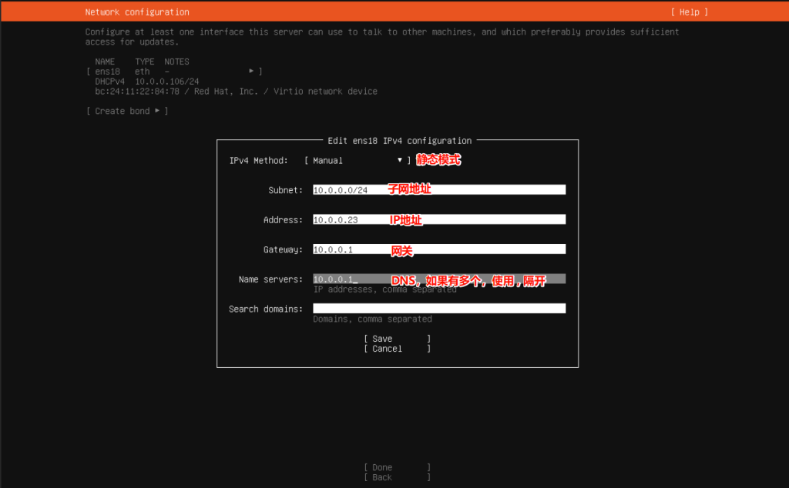
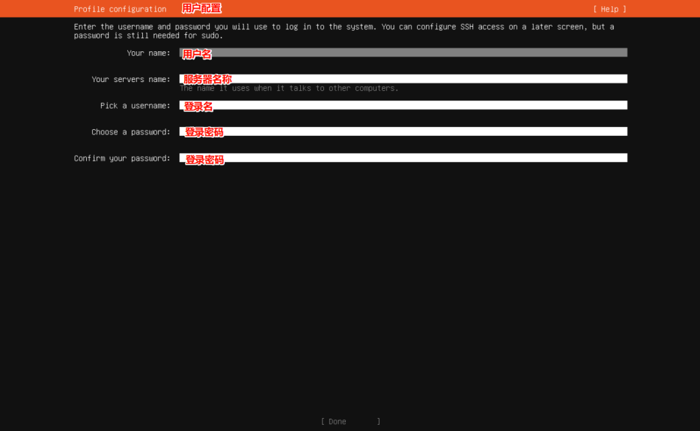
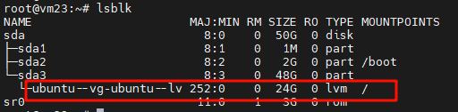
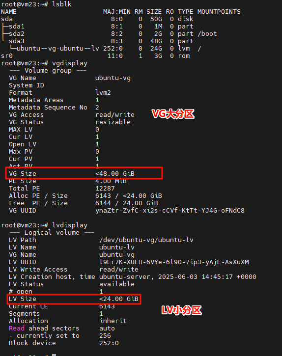

# 前言
红帽官方宣布CentOS 8于2021年年底结束维护。CentOS 已死！＂免费＂的 RHEL 没了…

在本教程中，我们将引导您逐步安装 Ubuntu 服务器 24.04 LTS。  
当然，此教程也适用于Ubunut Server 22.04 LTS
# 正文
# 下载镜像
去Ubuntu官网找到Ubuntu Server的镜像文件（[Ubuntu官网](https://ubuntu.com/download/server))），按照自己的需求下载 iso文件  
历史镜像地址：[Ubuntu-releases](https://releases.ubuntu.com/)
**制作启动盘**
可选用的工具有：
- [Rufus](https://rufus.ie/zh/)
- [**Etcher**](https://etcher.balena.io/)
- [**Ventoy**](https://www.ventoy.net/cn/index.html)
**随后重启系统，启动至U盘内的安装程序**  
# 系统安装
_没必要一步截一张图片，以文字为主。_  
1）进入到安装界面，默认选择第一项， Try orInstall Ubuntu Server -> 回车  
2）等待进入语言选择界面，因为没有中文，所以直接选择English 回车进入  
3）进入键盘配置界面，回车进入  
4）选择安装类型：
- 完整安装：默认安装包含一组精心策划的软件包，为操作您的服务器提供舒适的体验  
- 最小化安装：本已被定制为在人类不期望登录的环境中具有较小的运行时足迹。  
_这里推荐使用完整安装，因为最小化安装的组件是不全的。如果想要极简的linux系统，可以使用Alpine，最小。_  
5）配置网络，这里会展示出机器所有的网口，选中一个网口，在弹出的右侧框里面，选择 **Edit IPv4** 回车配置ipv4地址  
进行静态IP配置  
:::note[解释下是什么意思]
**Automatic**：DHCP模式，由路由器分配IP地址，但是地址可能会随着重启变化
**Manual**：静态IP模式
- **Subnet**：为子网IP，通常为xxx.xxx.xxx.0/24
- **Address**：为IP地址，通常为xxx.xxx.xxx.xxx，填写局域网内不冲突的ip地址
- **Gateway**：网关IP地址，通常为xxx.xxx.xxx.1
- **Name servers**：DNS地址
:::
填写完成之后，按**Tab**键，选择 **Save** 回车，看到地址更改后，选择**Done** 进入下一界面  

6）配置代理地址，通常情况下不需要配置  
7）配置镜像源，这里推荐使用清华大学镜像源，官方的源有点慢，填完之后回车进行验证  
```sql
# 清华大学镜像源  
http://mirrors.tuna.tsinghua.edu.cn/ubuntu
```
8）配置硬盘，一般不需要配置，直接回车下一步，然后选择Continue即可  
_PS：_ 这里有一个坑，在ubuntu安装时，/目录只会分配硬盘的一半容量，比如50G的硬盘，/目录最多23GB，这里推荐安装完成后，在系统里面去扩容。
9）配置用户信息，根据下面提示进行配置  
- Your name：用户名
- Your servers name：服务器名称
- Pick a username：登录名
- Choose a password：密码
- Confirm your password：密码

10）更新到最新的LTS版本，不需要更新，一路回车即可

11）SSH配置，按空格选中 **Install OpenSSH server** 随后选择Done 回车

12）其他组件配置不需要安装，直接选择最下面的Done回车即可。

13）等待安装完成之后，选择 **Reboot Now**回车重启

14）根据提示拔出安装介质后回车重启。

15）查看发行版本（可选）
```bash
lsb_release -a

# ------------------------
root@localhost:/# lsb_release -a
No LSB modules are available.
Distributor ID: Ubuntu
Description:    Ubuntu 24.04.3 LTS
Release:        24.04
Codename:       noble
```
# 系统基本设置
## root账户设置密码 
```bash
# 通过普通账户登录

# 切换至root用户
sudo su
# 修改root密码
passwd

## PS 此时root可以通过命令行直接登录了，但是不能通过ssh登录，因为ubuntu默认禁止root远程登录，请看下面
```
## SSH配置 允许root远程登录
```bash
# 查看是否安装了SSH服务
ps -ef |grep ssh 

# 没有安装的话，执行下面语句
sudo apt-get update                   #先更新下资源列表
sudo apt-get install openssh-server   #安装openssh-server
sudo ps -ef | grep ssh                #查看是否安装成功
sudo systemctl restart sshd           #重新启动SSH服务 

# 进入ssh配置文件
sudo vim  /etc/ssh/sshd_config
```

**修改Root远程登录权限**
按i进入编辑模式，找到`#PermitRootLogin prohibit-password`，默认是注释掉的。  
把 `PermitRootLogin without-password` 改为 `PermitRootLogin yes`，注意`PermitRootLogin without-password`被注释掉了，要去掉注释。如果没有找到`PermitRootLogin without-password`，直接文件末尾添加`PermitRootLogin yes`即可。然后按esc，输入:wq保存并退出。  
重启sshd服务
```bash
# 重启ssh服务
sudo systemctl daemon-reload
sudo systemctl restart ssh

# 如果连接不上，禁用防火墙
systemctl stop ufw
```
:::note
`PermitRootLogin` 是一个用于配置 SSH 服务器的选项。这个选项决定了是否允许 root 用户通过 SSH 直接登录到服务器。通常情况下，为了提高安全性，最好禁止 root 用户通过 SSH 直接登录，而是使用一个普通用户登录后再通过 su 或者 sudo 切换到 root 用户来执行需要特权的操作。这样可以降低系统受到攻击的风险。  
常见的 PermitRootLogin 选项取值包括：

- `yes`：允许 root 用户通过 SSH 直接登录。
- `no`：禁止 root 用户通过 SSH 直接登录。
- `without-password`：允许 root 用户通过 SSH 密钥登录，但不允许使用密码登录。
:::

## 网络配置
1）打开网络配置文件  
```bash
vi /etc/netplan/50-cloud-init.yaml
```
2）在文件中，找到`network`部分，然后根据你的网络设置进行编辑。以下是一个示例配置：  
```sql
network:
  version: 2
  ethernets:
    eno1:
      addresses:
      - "192.168.2.21/24"
      nameservers:
        addresses:
        - 192.168.2.1
        - 114.114.114.114
        search: []
      routes:
      - to: "default"
        via: "192.168.2.1"
    eno2:
      addresses:
      - "192.168.2.22/24"
    eno3:
      addresses:
      - "192.168.2.23/24"
    eno4:
      addresses:
      - "192.168.2.24/24"
```
- `eno1` 是网络接口的名称，你需要根据你的实际网络接口名称进行替换。
- `addresses` 是你的服务器的静态IP地址和子网掩码。
- `routes` 是你的网关IP地址。
- `nameservers` 是DNS服务器的IP地址。  
3）随后执行命令应用配置更改  
```bash
netplan apply
systemctl restart networking
```
4）在22.04中，会启用自动配置，如果你看到配置文件上面有一大堆被注释掉的文字，请取消自动配置  
```sql
# This file is generated from information provided by the datasource.  Changes
# to it will not persist across an instance reboot.  To disable cloud-init's
# network configuration capabilities, write a file
# /etc/cloud/cloud.cfg.d/99-disable-network-config.cfg with the following:
# network: {config: disabled}

```
使用下面的代码根据提示取消自动配置  
```bash
sudo tee /etc/cloud/cloud.cfg.d/99-disable-network-config.cfg << 'EOF'
network: {config: disabled}
EOF
```
5）禁用ipv6（可选）  
```bash
# 修改grub
vi /etc/default/grub

# 找到以下行，添加ipv6.disable=1
GRUB_CMDLINE_LINUX_DEFAULT="ipv6.disable=1"

# 更新GRUB
sudo update-grub
```
## 扩容硬盘
登录进系统，执行lsblk查看分区配置  

可以看到 **/** 目录下才24G，但是上级却有48G，严重不对，现在要进行扩容  

1）使用 `lvextend` 命令扩展逻辑卷：  
```bash
sudo lvextend -l +100%FREE /dev/ubuntu-vg/ubuntu-lv
```
2）扩展文件系统以使用新增加的空间（假设文件系统是 ext4 或 xfs）：  
```bash
# 对于 ext4 文件系统：
sudo resize2fs /dev/ubuntu-vg/ubuntu-lv

# 对于 XFS 文件系统：
sudo xfs_growfs /
```

## 防止自动升级版本  
修改更新策略  
```bash
vi /etc/update-manager/release-upgrades

# 改为
Prompt=never
```
## 换国内源
参考配置 [清华大学开源软件镜像站](https://mirrors.tuna.tsinghua.edu.cn/help/ubuntu/)  
**24.04 LTS**  
```bash
# 备份配置文件
mv /etc/apt/sources.list.d/ubuntu.sources /etc/apt/sources.list.d/ubuntu.sources.backup
# 或者直接删除配置文件
#rm /etc/apt/sources.list.d/ubuntu.sources
# 填入下面内容
vim /etc/apt/sources.list.d/ubuntu.sources
```
`ubuntu.sources`
```sql
Types: deb
URIs: https://mirrors.tuna.tsinghua.edu.cn/ubuntu
Suites: noble noble-updates noble-backports
Components: main restricted universe multiverse
Signed-By: /usr/share/keyrings/ubuntu-archive-keyring.gpg

# 默认注释了源码镜像以提高 apt update 速度，如有需要可自行取消注释
# Types: deb-src
# URIs: https://mirrors.tuna.tsinghua.edu.cn/ubuntu
# Suites: noble noble-updates noble-backports
# Components: main restricted universe multiverse
# Signed-By: /usr/share/keyrings/ubuntu-archive-keyring.gpg

# 以下安全更新软件源包含了官方源与镜像站配置，如有需要可自行修改注释切换
Types: deb
URIs: https://mirrors.tuna.tsinghua.edu.cn/ubuntu
Suites: noble-security
Components: main restricted universe multiverse
Signed-By: /usr/share/keyrings/ubuntu-archive-keyring.gpg

# Types: deb-src
# URIs: https://mirrors.tuna.tsinghua.edu.cn/ubuntu
# Suites: noble-security
# Components: main restricted universe multiverse
# Signed-By: /usr/share/keyrings/ubuntu-archive-keyring.gpg

# 预发布软件源，不建议启用

# Types: deb
# URIs: https://mirrors.tuna.tsinghua.edu.cn/ubuntu
# Suites: noble-proposed
# Components: main restricted universe multiverse
# Signed-By: /usr/share/keyrings/ubuntu-archive-keyring.gpg

# # Types: deb-src
# # URIs: https://mirrors.tuna.tsinghua.edu.cn/ubuntu
# # Suites: noble-proposed
# # Components: main restricted universe multiverse
# # Signed-By: /usr/share/keyrings/ubuntu-archive-keyring.gpg
```

**22.04LTS**  
```bash
# 备份配置文件
mv /etc/apt/sources.list /etc/apt/sources.list.backup
# 或者直接删除配置文件
#rm /etc/apt/sources.list
# 填入下面内容
vim /etc/apt/sources.list
```
`sources.list`
```sql
# 默认注释了源码镜像以提高 apt update 速度，如有需要可自行取消注释
deb https://mirrors.tuna.tsinghua.edu.cn/ubuntu/ jammy main restricted universe multiverse 
# deb-src https://mirrors.tuna.tsinghua.edu.cn/ubuntu/ jammy main restricted universe multiverse 
deb https://mirrors.tuna.tsinghua.edu.cn/ubuntu/ jammy-updates main restricted universe multiverse 
# deb-src https://mirrors.tuna.tsinghua.edu.cn/ubuntu/ jammy-updates main restricted universe multiverse 
deb https://mirrors.tuna.tsinghua.edu.cn/ubuntu/ jammy-backports main restricted universe multiverse 
# deb-src https://mirrors.tuna.tsinghua.edu.cn/ubuntu/ jammy-backports main restricted universe multiverse 
deb https://mirrors.tuna.tsinghua.edu.cn/ubuntu/ jammy-security main restricted universe multiverse 
# deb-src https://mirrors.tuna.tsinghua.edu.cn/ubuntu/ jammy-security main restricted universe multiverse 

# 预发布软件源，不建议启用 
# deb https://mirrors.tuna.tsinghua.edu.cn/ubuntu/ jammy-proposed main restricted universe multiverse 
# deb-src https://mirrors.tuna.tsinghua.edu.cn/ubuntu/ jammy-proposed main restricted universe multiverse
```
替换源后更新源  
```bash
sudo apt update -y
sudo apt upgrade -y
```
最后会弹出一个让你重启服务的框，选择ok就可以，最后最好重启一下系统，将服务全部重启。  
## 安装必要软件
```bash
apt install -y zip unzip htop tree iperf3

```

- zip unzip # zip解压工具
- htop # 资源监控工具
- tree # 文件目录查看工具
- iperf3 # 打流测速工具

## 其他
1）nfs协议挂载目录  
```bash
# 安装nfs
sudo apt install nfs-common
# 创建挂载目录
mkdir /mnt/appdata

# 测试挂载
mount 10.0.0.10:/mnt/SSD-Storage/appdata/vm-docker /mnt/appdata
# 取消挂载
umount /mnt/appdata

# 开机自动挂载目录
vim /etc/fstab
# 添加以下内容
10.0.0.10:/mnt/SSD-Storage/appdata/vm-docker /mnt/appdata nfs defaults 0 0
```